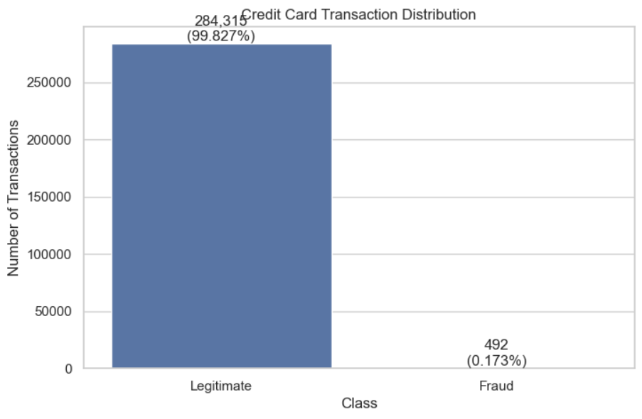
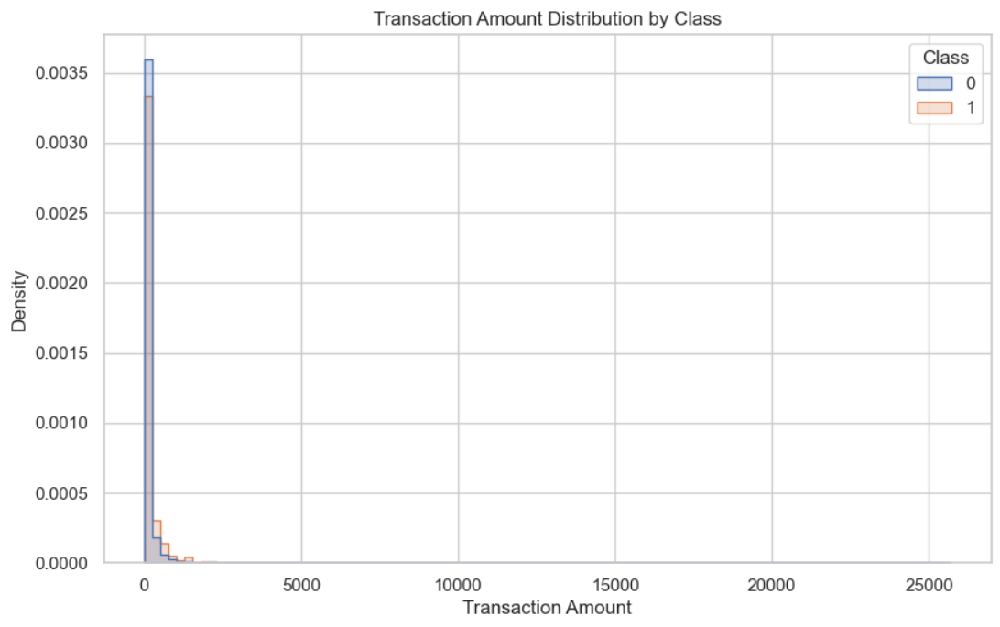
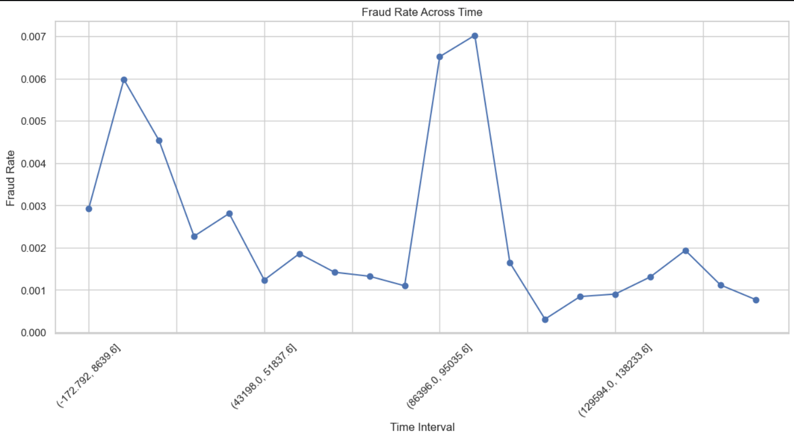
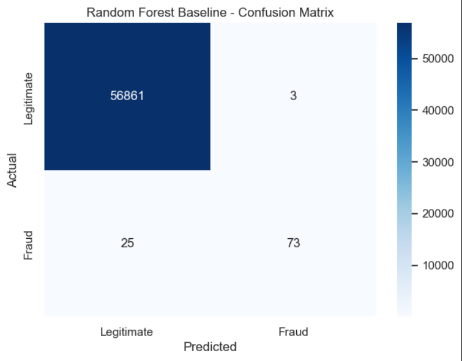

# Credit Card Fraud Detection Using Random Forest


## Project Overview

Credit card fraud is a major challenge in the modern digital payment ecosystem. With millions of financial transactions being processed every day, identifying fraudulent transactions manually is difficult, time-consuming, and inefficient.

This project presents a **Machine Learning-based Credit Card Fraud Detection System using the Random Forest Classification algorithm**.

The objective of the project is to classify credit card transactions into two categories:

*  **Legitimate Transaction**
*  **Fraudulent Transaction**

The major challenge in this project is the **severe class imbalance** between legitimate and fraudulent transactions. Therefore, this project evaluates the model using not only accuracy but also precision, recall, F1-score, ROC-AUC, PR-AUC, and the confusion matrix.

---

# Objectives

The major objectives of this project are:

1. Analyze credit card transaction data.
2. Understand the characteristics of fraudulent transactions.
3. Explore the class imbalance present in the dataset.
4. Perform exploratory data analysis (EDA).
5. Build a Random Forest classification model.
6. Handle the minority fraud class using class-balanced learning.
7. Predict fraudulent transactions.
8. Evaluate the model using multiple performance metrics.
9. Visualize model performance.
10. Identify research gaps and future improvements.

---

# Dataset

The project uses the **Credit Card Fraud Detection** dataset available through Kaggle.

### Dataset Source

**Kaggle Dataset:**

https://www.kaggle.com/datasets/mlg-ulb/creditcardfraud

The dataset contains:

| Property                |       Value |
| ----------------------- | ----------: |
| Total Transactions      | **284,807** |
| Legitimate Transactions | **284,315** |
| Fraudulent Transactions |     **492** |
| Total Features          |      **30** |
| Target Variable         |   **Class** |

Fraudulent transactions represent approximately **0.173%** of all transactions, making this a highly imbalanced classification problem.

> ⚠️ The dataset is intentionally not included directly in this GitHub repository. Users can download it from the Kaggle source above.

---

# Dataset Setup

After downloading the dataset from Kaggle, place the CSV file inside the `data` folder.

The expected location is:

```text
data/
└── creditcard.csv
```

The complete project structure look like:

```text
credit-card-fraud-detection-random-forest/
│
├── data/
│   └── creditcard.csv
│
├── notebooks/
│   └── Credit_Card_Fraud_Detection.ipynb
│
├── figures/
│   ├── class_distribution.png
│   ├── amount_distribution.png
│   ├── fraud_rate_time.png
│   ├── confusion_matrix.png
│   └── project_flow.png
│
├── documentation/
│   └── Credit_Card_Fraud_Detection_Research_Paper.docx
│
├── README.md
├── requirements.txt
└── .gitignore
```

---

#  Dataset Features

The dataset contains the following main variables:

### `Time`

The number of seconds elapsed between each transaction and the first transaction in the dataset.

### `V1 – V28`

Anonymized numerical features generated through Principal Component Analysis (PCA).

Because these variables are anonymized, their direct business meanings are not available.

### `Amount`

The transaction amount.

### `Class`

The target variable:

```text
0 → Legitimate Transaction
1 → Fraudulent Transaction
```

---

#  Problem Statement

Given a credit card transaction represented by its available features, the goal is to determine whether the transaction is legitimate or fraudulent.

Mathematically:

```text
X = {Time, V1, V2, ..., V28, Amount}
```

The machine learning model learns a function:

```text
f(X) → Y
```

where:

```text
Y = 0 → Legitimate
Y = 1 → Fraud
```

The primary challenge is that fraudulent transactions are extremely rare compared with legitimate transactions.

---

#  Project Workflow

```text
                    ┌─────────────────────┐
                    │   Kaggle Dataset    │
                    │   creditcard.csv    │
                    └──────────┬──────────┘
                               │
                               ▼
                    ┌─────────────────────┐
                    │ Data Loading &      │
                    │ Data Validation     │
                    └──────────┬──────────┘
                               │
                               ▼
                    ┌─────────────────────┐
                    │ Exploratory Data    │
                    │ Analysis (EDA)      │
                    └──────────┬──────────┘
                               │
                               ▼
                    ┌─────────────────────┐
                    │ Train/Test Split    │
                    │ 80% / 20%           │
                    │ Stratified          │
                    └──────────┬──────────┘
                               │
                               ▼
                    ┌─────────────────────┐
                    │ Random Forest       │
                    │ Classifier          │
                    │ 100 Trees           │
                    └──────────┬──────────┘
                               │
                               ▼
                    ┌─────────────────────┐
                    │ Fraud Prediction    │
                    │ Class + Probability │
                    └──────────┬──────────┘
                               │
                               ▼
                    ┌─────────────────────┐
                    │ Model Evaluation    │
                    │ Precision / Recall  │
                    │ F1 / ROC-AUC / PR   │
                    └──────────┬──────────┘
                               │
                               ▼
                    ┌─────────────────────┐
                    │ Fraud / Legitimate  │
                    │ Decision            │
                    └─────────────────────┘
```

---

#  Methodology

The project follows the following steps:

## 1. Data Loading

The dataset is loaded using Pandas.

```python
import pandas as pd

df = pd.read_csv("data/creditcard.csv")
```

---

## 2. Data Exploration

The dataset is analyzed for:

* Number of records
* Number of features
* Data types
* Missing values
* Duplicate records
* Statistical information
* Class distribution
* Transaction amounts
* Transaction time
* Feature distributions

---

## 3. Class Imbalance

The dataset contains approximately:

```text
Legitimate Transactions → 99.827%
Fraudulent Transactions → 0.173%
```

This means accuracy alone can be misleading.

For example, a model that predicts every transaction as legitimate could achieve approximately 99.83% accuracy while detecting **zero fraudulent transactions**.

Therefore, this project emphasizes:

* Precision
* Recall
* F1-score
* ROC-AUC
* Precision-Recall AUC
* Confusion Matrix

---

#  Random Forest Classification

The primary machine learning algorithm used in this project is the **Random Forest Classifier**.

Random Forest is an ensemble learning method that combines multiple decision trees.

Each decision tree produces a prediction, and the Random Forest combines these predictions to obtain the final classification.

### Mathematical Formulation

For a transaction `x`, suppose the Random Forest contains `B` decision trees:

```text
h₁(x), h₂(x), ..., hB(x)
```

The final prediction is:

```text
ŷ = mode{h₁(x), h₂(x), ..., hB(x)}
```

The estimated probability of fraud can be represented as:

```text
P(y = 1 | x) = (1/B) Σ P_b(y = 1 | x)
```

A transaction can then be flagged as fraudulent when:

```text
P(y = 1 | x) ≥ τ
```

where `τ` represents the classification threshold.

---

#  Random Forest Configuration

The implemented Random Forest model uses:

```python
RandomForestClassifier(
    n_estimators=100,
    random_state=42,
    class_weight="balanced",
    n_jobs=-1
)
```

### Parameters

| Parameter      |    Value | Description                                    |
| -------------- | -------: | ---------------------------------------------- |
| `n_estimators` |      100 | Number of decision trees                       |
| `random_state` |       42 | Ensures reproducibility                        |
| `class_weight` | balanced | Gives greater importance to the minority class |
| `n_jobs`       |       -1 | Uses available CPU cores                       |

---

#  Train/Test Split

The dataset is divided using an **80/20 stratified train-test split**.

```python
train_test_split(
    X,
    y,
    test_size=0.20,
    random_state=42,
    stratify=y
)
```

### Dataset Split

```text
Training Set → 227,845 transactions
Testing Set  → 56,962 transactions
```

The test set contains:

```text
Legitimate → 56,864
Fraud      → 98
```

---

#  Model Performance

The Random Forest model achieved the following results on the held-out test dataset:

| Metric    |        Score |
| --------- | -----------: |
| Accuracy  | **99.9508%** |
| Precision | **96.0526%** |
| Recall    | **74.4898%** |
| F1-Score  | **83.9080%** |
| ROC-AUC   |   **0.9529** |
| PR-AUC    |   **0.8542** |

---

#  Confusion Matrix

The model generated the following confusion matrix:

|                       | Predicted Legitimate | Predicted Fraud |
| --------------------- | -------------------: | --------------: |
| **Actual Legitimate** |               56,861 |               3 |
| **Actual Fraud**      |                   25 |              73 |

Therefore:

```text
True Negative  = 56,861
False Positive = 3
False Negative = 25
True Positive   = 73
```

The model detected:

```text
73 / 98
```

fraudulent transactions in the test set.

However, it missed:

```text
25
```

fraudulent transactions.

This demonstrates why **recall is extremely important in financial fraud detection**.

---

#  Visualizations

The project includes several visualizations to understand the data and model performance.

## Class Distribution



Shows the severe imbalance between legitimate and fraudulent transactions.

---

## Transaction Amount Distribution



Shows the distribution of transaction amounts using a logarithmic transformation for better visualization.

---

## Fraud Rate Across Time



Shows how the observed fraud rate changes across transaction-time intervals.

---

## Confusion Matrix



Shows the correct and incorrect predictions made by the Random Forest model.

---

## ROC Curve


The model achieved a ROC-AUC of approximately:

```text
0.9529
```

---

## Precision-Recall Curve


Precision-Recall analysis is especially useful for highly imbalanced datasets such as fraud detection.

---

## Feature Importance


Shows the most influential features according to the Random Forest model.

---

#  Technologies Used

## Programming Language

* Python

## Data Processing

* Pandas
* NumPy

## Machine Learning

* Scikit-learn
* Random Forest

## Data Visualization

* Matplotlib
* Seaborn

## Imbalanced Learning

* imbalanced-learn

## Model Persistence

* Joblib

## Development Environment

* Jupyter Notebook

---

# Installation

Clone the repository:

```bash
git clone https://github.com/Riktam45/credit-card-fraud-detection-random-forest.git
```

Move into the project directory:

```bash
cd credit-card-fraud-detection-random-forest
```

Create a virtual environment:

```bash
python -m venv venv
```

### Windows

```bash
venv\Scripts\activate
```

### Linux / macOS

```bash
source venv/bin/activate
```

Install the required packages:

```bash
pip install -r requirements.txt
```

---

#  Requirements

Create a `requirements.txt` file containing:

```text
pandas
numpy
matplotlib
seaborn
scikit-learn
imbalanced-learn
joblib
jupyter
```

Install:

```bash
pip install -r requirements.txt
```

---

#  How to Run

### Step 1 — Download the Dataset

Download the dataset from Kaggle:

https://www.kaggle.com/datasets/mlg-ulb/creditcardfraud

### Step 2 — Place the Dataset

Place:

```text
creditcard.csv
```

inside:

```text
data/
```

So the final location should be:

```text
data/creditcard.csv
```

### Step 3 — Launch Jupyter Notebook

```bash
jupyter notebook
```

### Step 4 — Open the Notebook

Open:

```text
notebooks/Credit_Card_Fraud_Detection.ipynb
```

### Step 5 — Run All Cells

Run the notebook from beginning to end to reproduce the analysis and model results.

---


#  Authors

### Riktam45

**GitHub:**
https://github.com/Riktam45

---

The dataset is obtained from Kaggle and remains subject to its original licensing and usage terms.
